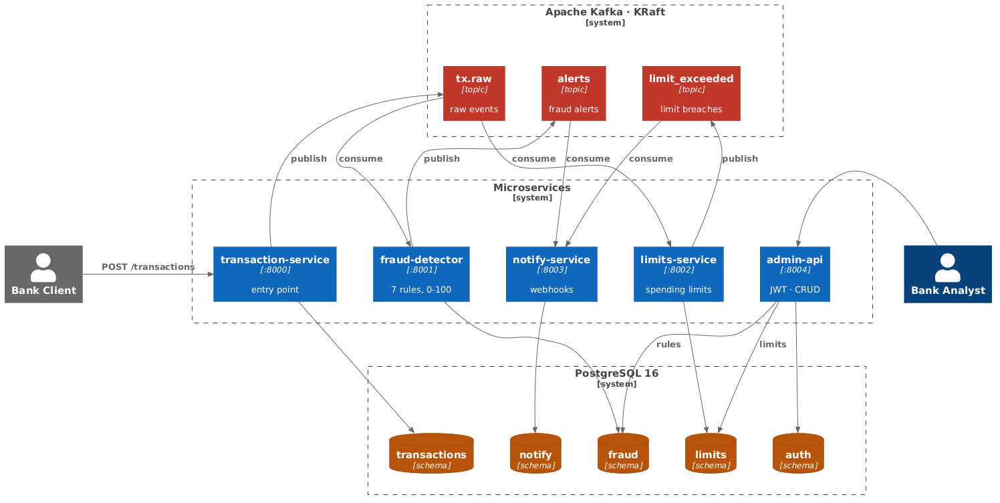
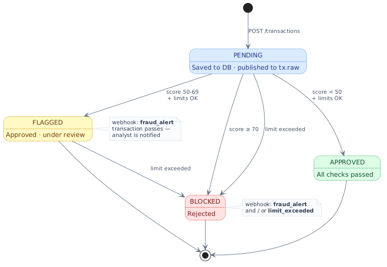

# Event-Driven Fraud Detector

Доступно на русском: [README.md](../README.md)

Real-time fraudulent transaction detection system.
Five FastAPI microservices communicating through Apache Kafka — no HTTP calls between services.


---

## How It Works

A client submits a transaction — `transaction-service` validates it, writes it to the database
with status `PENDING`, and publishes an event to Kafka. Three consumers process it
in parallel and independently:

```
POST /transactions
  └─▶ transaction-service ──publish──▶ tx.raw
                                           ├─▶ fraud-detector   (7 rules → score 0–100)
                                           │       └─publish──▶ alerts ──▶ notify-service
                                           └─▶ limits-service   (daily / monthly limit)
                                                   └─publish──▶ limit_exceeded ──▶ notify-service
```

The client receives `202 Accepted` — the transaction is already being processed. In ~300 ms the
status will change to `APPROVED`, `FLAGGED`, or `BLOCKED`.



---

## Services

| Service | Port | Purpose |
|---|---|---|
| transaction-service | 8000 | Entry point. Validation, INSERT PENDING, publish to Kafka |
| fraud-detector | 8001 | 7 fraud rules → score 0–100 → update status in DB |
| limits-service | 8002 | Daily and monthly spending limits per user |
| notify-service | 8003 | Webhook notifications for alerts and limit breaches |
| admin-api | 8004 | CRUD for rules and limits, JWT authentication |

---

## Stack

| Layer | Technologies |
|---|---|
| API | Python 3.13, FastAPI, Pydantic v2, SQLAlchemy 2.0 async |
| Queue | Apache Kafka 7.7 (KRaft), aiokafka |
| DB | PostgreSQL 16, asyncpg |
| Monitoring | Prometheus, Grafana, structlog (JSON logs) |
| Tests | pytest, pytest-asyncio, httpx AsyncClient |
| Infrastructure | Docker Compose, UV, Makefile |

---

## Running

**Requirements:** Docker Desktop, Make (optional — full Docker commands work too).

```bash
git clone https://github.com/MrHoustonOff/event-driven-fraud-detector.git
cd event-driven-fraud-detector
cp .env.example .env
make up
```

Verify all 10 containers are healthy:

```bash
make ps
```

```
NAME                    STATUS
transaction-service     healthy
fraud-detector          healthy
limits-service          healthy
notify-service          healthy
admin-api               healthy
postgres                healthy
kafka                   healthy
kafka-ui                healthy
prometheus              healthy
grafana                 healthy
```

| URL | What |
|---|---|
| http://localhost:8000/docs | transaction-service — Swagger UI |
| http://localhost:8004/docs | admin-api — Swagger UI |
| http://localhost:8080 | Kafka UI — topics and messages |
| http://localhost:9090 | Prometheus |
| http://localhost:3000 | Grafana |

---

## API

### Create a Transaction

`POST /transactions` accepts JSON:

| Field | Type | Required | Description |
|---|---|---|---|
| user_id | integer | yes | Client ID (> 0) |
| amount | string (decimal) | yes | Amount, e.g. `"1500.00"` |
| currency | string | no | **ISO 4217**, DEFAULT `"RUB"` |
| country | string | yes | **ISO 3166-1 alpha-2**, e.g. `"RU"` |
| city | string | yes | Transaction city |
| merchant | string | yes | Store / service name |

Example:

```bash
curl -X POST http://localhost:8000/transactions \
  -H "Content-Type: application/json" \
  -d '{
    "user_id": 1,
    "amount": "1500.00",
    "currency": "RUB",
    "country": "RU",
    "city": "Moscow",
    "merchant": "Wildberries"
  }'
# HTTP 202
# {"id": "550e8400-...", "status": "PENDING"}
```

### Check Transaction Status

```bash
curl http://localhost:8000/transactions/{id}
# {"id": "...", "status": "APPROVED", "fraud_score": 0, ...}
```

### admin-api

Authentication — JWT (Bearer token). Analysts and risk managers log in with
`username` + `password`, receive a token, and use protected endpoints.

```bash
# Get a token
curl -X POST http://localhost:8004/auth/login \
  -d "username=admin&password=secret"
# {"access_token": "eyJ...", "token_type": "bearer"}

# Use the token
curl http://localhost:8004/rules \
  -H "Authorization: Bearer eyJ..."
```

---

## Fraud Rules

The engine is built on the **Strategy** pattern: each rule is a separate class with a
`score()` method. Scores are summed, capped at 100.

| Rule | Condition | Score |
|---|---|---|
| `LargeAmountRule` | amount > 10 000 ₽ | +10 |
| `LargeAmountRule` | amount > 30 000 ₽ | +30 (replaces +10) |
| `NewCountryRule` | country not seen in user's history | +40 |
| `HighFrequencyRule` | >5 transactions in the last 60 minutes | +25 |
| `NightTimeRule` | time 02:00–05:00 UTC | +15 |
| `UnusualCityRule` | city not seen in last 30 transactions | +20 |
| `VelocityAmountRule` | amount > user's average × 3 | +20 |

| Score | Status | What happens |
|---|---|---|
| < 50 | `APPROVED` | Transaction passes |
| 50–69 | `FLAGGED` | Passes, flagged for manual review |
| ≥ 70 | `BLOCKED` | Blocked automatically |

---

## Transaction Lifecycle

| Status | Condition | Webhook |
|---|---|---|
| `APPROVED` | score < 50, limits OK | none |
| `FLAGGED` | score 50–69, limits OK | `fraud_alert` |
| `BLOCKED` | score ≥ 70 | `fraud_alert` |
| `BLOCKED` | limit exceeded | `limit_exceeded` |

`FLAGGED` — the transaction is **approved and processed**, but flagged for manual review.
The analyst sees it in the dashboard and receives a webhook. The funds have already been charged.



---

## Database Schema

One PostgreSQL instance, five isolated schemas (a simplification for this project — in production
each service would have its own database). Each service only touches its own schema.

### transactions.transactions

| Column | Type | Constraints |
|---|---|---|
| id | UUID | PK, DEFAULT gen_random_uuid() |
| user_id | INTEGER | NOT NULL |
| amount | NUMERIC(15,2) | NOT NULL |
| currency | VARCHAR(3) | NOT NULL, DEFAULT 'RUB' |
| country | CHAR(2) | NOT NULL |
| city | VARCHAR(100) | NOT NULL |
| merchant | VARCHAR(255) | NOT NULL |
| status | VARCHAR(20) | NOT NULL, DEFAULT 'PENDING' |
| fraud_score | INTEGER | nullable |
| created_at | TIMESTAMPTZ | NOT NULL |
| updated_at | TIMESTAMPTZ | NOT NULL |

| Index | Columns | Purpose |
|---|---|---|
| idx_tx_user_created | (user_id, created_at DESC) | user history for the rule engine |
| idx_tx_status | (status) | fetching PENDING transactions |

### fraud.rules

| Column | Type | Constraints |
|---|---|---|
| id | SERIAL | PK |
| name | VARCHAR(100) | NOT NULL, UNIQUE |
| weight | INTEGER | NOT NULL, CHECK 0..100 |
| config_json | JSONB | nullable |
| is_active | BOOLEAN | NOT NULL, DEFAULT true |
| created_at | TIMESTAMPTZ | NOT NULL |

### limits.user_limits

| Column | Type | Constraints |
|---|---|---|
| user_id | INTEGER | PK |
| daily_limit | NUMERIC(15,2) | NOT NULL, DEFAULT 100 000 |
| monthly_limit | NUMERIC(15,2) | NOT NULL, DEFAULT 500 000 |
| updated_at | TIMESTAMPTZ | NOT NULL |

### limits.spending_log

| Column | Type | Constraints |
|---|---|---|
| id | SERIAL | PK |
| user_id | INTEGER | NOT NULL, FK → user_limits |
| amount | NUMERIC(15,2) | NOT NULL |
| transaction_id | UUID | NOT NULL, UNIQUE — idempotency |
| created_at | TIMESTAMPTZ | NOT NULL |

| Index | Columns | Purpose |
|---|---|---|
| idx_spending_user_date | (user_id, created_at DESC) | aggregating spend over a period |

### notify.notifications

| Column | Type | Constraints |
|---|---|---|
| id | SERIAL | PK |
| user_id | INTEGER | NOT NULL |
| type | VARCHAR(50) | NOT NULL (`fraud_alert` / `limit_exceeded`) |
| payload | JSONB | NOT NULL |
| status | VARCHAR(20) | NOT NULL, DEFAULT 'sent' |
| error_message | TEXT | nullable |
| created_at | TIMESTAMPTZ | NOT NULL |

### auth.users

| Column | Type | Constraints |
|---|---|---|
| id | SERIAL | PK |
| username | VARCHAR(50) | NOT NULL, UNIQUE |
| password_hash | VARCHAR(60) | NOT NULL — bcrypt, work_factor=12 |
| is_active | BOOLEAN | NOT NULL, DEFAULT true |
| created_at | TIMESTAMPTZ | NOT NULL |

---

## Load Test

Locust, 300 concurrent users (90% RegularUser + 10% FraudUser), 3 minutes.

| Metric | Before optimization | After optimization | Δ |
|---|---|---|---|
| RPS | 183 | **216** | +18% |
| p50 | 250 ms | **25 ms** | −90% |
| p95 | 740 ms | **190 ms** | −74% |
| p99 | 1 100 ms | **330 ms** | −70% |
| Error rate | 0% | **0%** | — |

The bottleneck was `pool_size=5` (SQLAlchemy default). With 300 users, requests queued behind
five connections. After `pool_size=20, max_overflow=0`: p95 dropped from 740 to 190 ms.
Details: [load-test/results.md](https://github.com/MrHoustonOff/event-driven-fraud-detector/blob/main/load-test/results.md).

---

## Tests

```bash
# E2E test — full pipeline: POST → Kafka → status update in DB
make test

# Tests for a specific service
cd services/fraud-detector && uv run pytest -v
cd services/transaction-service && uv run pytest -v
# ... same for the rest
```

83+ tests total: unit (each fraud rule in isolation), integration (routes via httpx AsyncClient),
idempotency (UNIQUE constraint blocks duplicates).

---

## Project Structure

```
event-driven-fraud-detector/
├── shared/                   # Pydantic schemas: TransactionEvent, AlertEvent, ...
├── services/
│   ├── transaction-service/  # FastAPI :8000
│   ├── fraud-detector/       # FastAPI :8001
│   ├── limits-service/       # FastAPI :8002
│   ├── notify-service/       # FastAPI :8003
│   └── admin-api/            # FastAPI :8004
├── postgres/init.sql         # DDL: schemas, tables, indexes
├── monitoring/               # prometheus.yml, Grafana dashboards
├── load-test/                # Locust scenarios + results
├── tests/                    # E2E test of the full pipeline
├── docs/                     # C4 Container Diagram, ER Diagram
├── docker-compose.yml
└── Makefile
```

Each service follows the same structure:

```
service-name/
├── app/
│   ├── main.py          # FastAPI app, lifespan (startup/shutdown)
│   ├── config.py        # pydantic-settings, environment variables
│   ├── models.py        # SQLAlchemy ORM models
│   ├── schemas.py       # Pydantic request/response schemas
│   ├── db/session.py    # async engine, get_session dependency
│   ├── kafka/           # producer / consumer
│   └── routes/          # FastAPI routes
├── tests/
├── Dockerfile
└── pyproject.toml
```
