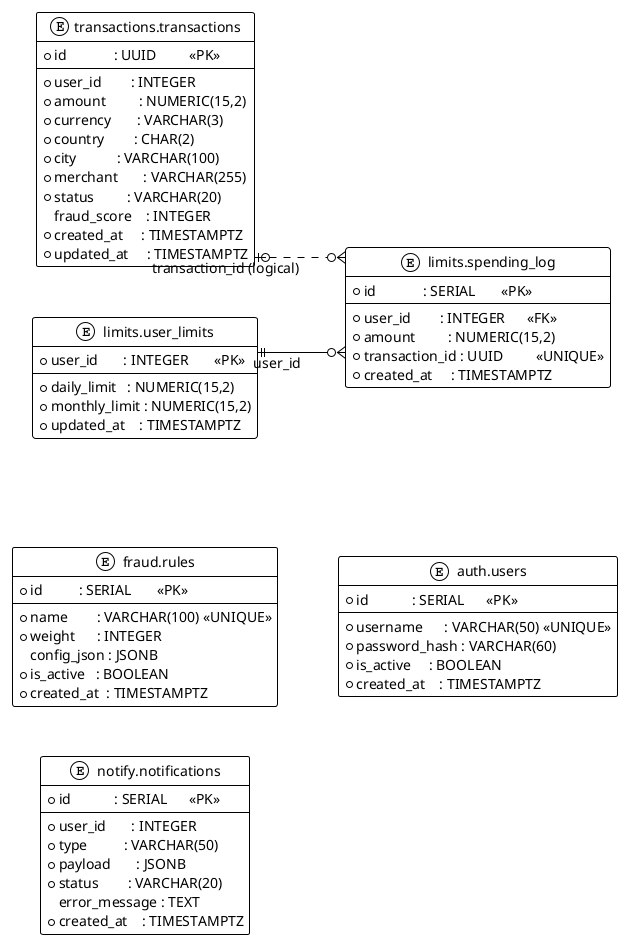

# ER Diagram — Database Schema

Render: https://www.plantuml.com/plantuml/uml

```plantuml
@startuml

!theme plain
skinparam linetype ortho
skinparam defaultFontSize 14
skinparam nodesep 50
skinparam ranksep 60

left to right direction

' * = NOT NULL   no * = nullable

entity "transactions.transactions" as tx {
    * id             : UUID         <<PK>>
    --
    * user_id        : INTEGER
    * amount         : NUMERIC(15,2)
    * currency       : VARCHAR(3)
    * country        : CHAR(2)
    * city           : VARCHAR(100)
    * merchant       : VARCHAR(255)
    * status         : VARCHAR(20)
      fraud_score    : INTEGER
    * created_at     : TIMESTAMPTZ
    * updated_at     : TIMESTAMPTZ
}

entity "fraud.rules" as rules {
    * id          : SERIAL       <<PK>>
    --
    * name        : VARCHAR(100) <<UNIQUE>>
    * weight      : INTEGER
      config_json : JSONB
    * is_active   : BOOLEAN
    * created_at  : TIMESTAMPTZ
}

entity "limits.user_limits" as ul {
    * user_id       : INTEGER       <<PK>>
    --
    * daily_limit   : NUMERIC(15,2)
    * monthly_limit : NUMERIC(15,2)
    * updated_at    : TIMESTAMPTZ
}

entity "limits.spending_log" as sl {
    * id             : SERIAL       <<PK>>
    --
    * user_id        : INTEGER      <<FK>>
    * amount         : NUMERIC(15,2)
    * transaction_id : UUID         <<UNIQUE>>
    * created_at     : TIMESTAMPTZ
}

entity "notify.notifications" as notif {
    * id            : SERIAL      <<PK>>
    --
    * user_id       : INTEGER
    * type          : VARCHAR(50)
    * payload       : JSONB
    * status        : VARCHAR(20)
      error_message : TEXT
    * created_at    : TIMESTAMPTZ
}

entity "auth.users" as auth_u {
    * id            : SERIAL      <<PK>>
    --
    * username      : VARCHAR(50) <<UNIQUE>>
    * password_hash : VARCHAR(60)
    * is_active     : BOOLEAN
    * created_at    : TIMESTAMPTZ
}

' Relationships
ul ||--o{ sl : "user_id"
tx |o..o{ sl : "transaction_id (logical)"

@enduml
```
