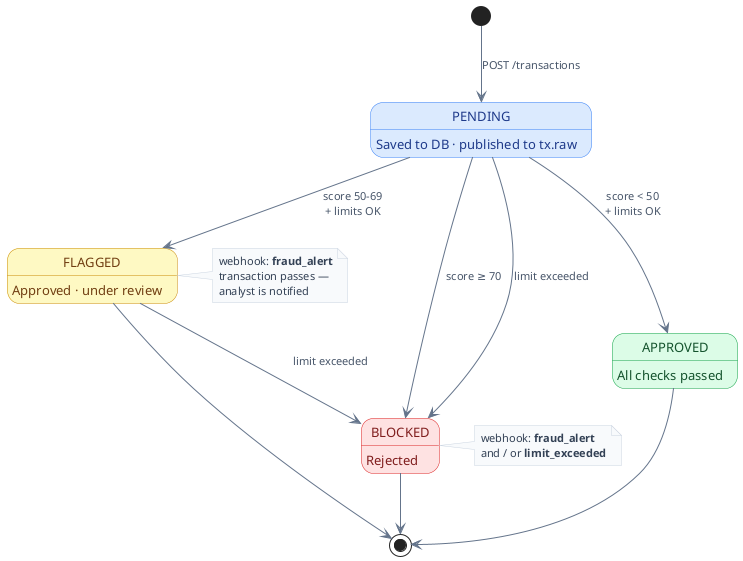

# Transaction Lifecycle — State Diagram

Render: https://www.plantuml.com/plantuml/uml

```plantuml
@startuml

skinparam defaultFontSize 13
skinparam shadowing false
skinparam backgroundColor #FFFFFF

skinparam state {
    FontColor       #1e293b
    ArrowColor      #64748b
    ArrowFontSize   11
    ArrowFontColor  #475569
}

skinparam state<<pending>> {
    BackgroundColor #dbeafe
    BorderColor     #3b82f6
    FontColor       #1e3a8a
}

skinparam state<<approved>> {
    BackgroundColor #dcfce7
    BorderColor     #16a34a
    FontColor       #14532d
}

skinparam state<<flagged>> {
    BackgroundColor #fef9c3
    BorderColor     #ca8a04
    FontColor       #713f12
}

skinparam state<<blocked>> {
    BackgroundColor #fee2e2
    BorderColor     #dc2626
    FontColor       #7f1d1d
}

skinparam note {
    BackgroundColor #f8fafc
    BorderColor     #cbd5e1
    FontColor       #334155
    FontSize        11
}

[*] --> PENDING : POST /transactions

state PENDING<<pending>>  : Saved to DB · published to tx.raw
state APPROVED<<approved>> : All checks passed
state FLAGGED<<flagged>>   : Approved · under review
state BLOCKED<<blocked>>   : Rejected

PENDING  --> APPROVED : score < 50\n+ limits OK
PENDING  --> FLAGGED  : score 50–69\n+ limits OK
PENDING  --> BLOCKED  : score ≥ 70
PENDING  --> BLOCKED  : limit exceeded
FLAGGED  --> BLOCKED  : limit exceeded

APPROVED --> [*]
FLAGGED  --> [*]
BLOCKED  --> [*]

note right of FLAGGED
  webhook: **fraud_alert**
  transaction passes —
  analyst is notified
end note

note right of BLOCKED
  webhook: **fraud_alert**
  and / or **limit_exceeded**
end note

@enduml
```
